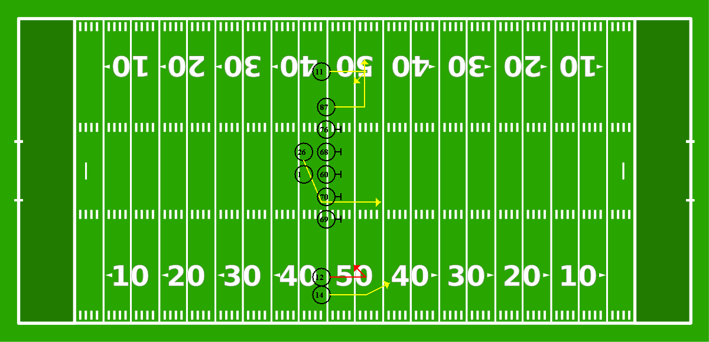

# Offensive Playbook Compiler

A football compiler, able to create some offensive playbooks by declaring your players, a formation and their routes.



## Getting Started

### Prerequisites

The compiler was builted with Java and ANTLR. So to compile it on your machine, it's necessary to have installed in your execution enviroment the following components:

[MAVEN](https://maven.apache.org/) - *versão utilizada: 1.8.0_111*

[JAVA](https://www.java.com/pt-BR/) - *versão utilizada: 3.6.3*

### Compiling

To build the jar executable, you need to download this repository. After that, execute in you prompt, while inside the project directory, the following command:

`mvn clean install`

This will install all necessary dependencies to execute the program.

Next, to execute and create your playbook, you'll need to use the following command:

`offensive-playbook-compiler-1.0-SNAPSHOT-jar-with-dependencies <input-file>.txt <output-file>.png`

After that, a image containing all specification of your playbook will be generated in the output-file location (if informed). In case of errors, a dump file containing all errors will be created and stored on the same directory as the input-file.

## Running the tests

Some tests for this compiler can be found in [`tests`](https://github.com/FelTavoni/offensive-playbook-compiler/tree/main/tests). The tests cover Lexic, Sintatic and Semantic errors.

### Windows

To run the tests in Windows, a batch script is provided (`scripTest.bat`).

### Unix

Currently, there's no script for Linux.

## How to use

To use the compiler, it's necessary to write a file `.txt` containing all the informations necessary, like *roster*, *yard line*, *formation*, *positions* and *routes*.

### *Roster*

Here, you'll declare all of your players, mentioning their jersey number, role in the playbook and his name (for errors purpose).

### *Yard line*

It's necessary to inform the snap line that the play will take place.

### *Formation*

The roles that you need to execute your play. Notice that some players can't occupie a same spot in the playbook.

### *Routes*

For you receiving options - or running one - you'll need to inform their routes to be performed.

As an example, for generation the image on top, here's what a file should looks like.

```
Roster:
        76 OT Offensive Tackle One
        68 OG Offensive Guard One
        69 OT Offensive Tackle Two
        70 OG Offensive Guard Two
        60 C CEnter One
        1 QB Quarterback One
        87 TE Tight End One
        89 TE Tight End Two
        12 WR Wide Receiver One
        11 WR Wide Receiver Two
        14 WR Wide Receiver Three
        16 WR Wide Receiver Four
        28 RB Running Back One
        26 HB Half Back One
        37 FB Full Back One 
Yard Line:
        45
Play Type:
        Pass
Formation:
        2 OT
        2 OG
        1 C
        1 TE
        3 WR
        1 QB
        1 HB
Positions:
        76 Left
        68 Left
        60 Center
        69 Right
        70 Right
        1 Lined
        87 Lined Left
        11 Idented Middle Left
        12 Idented Middle Right
        14 Idented Far Right
        26 Left First
Routes:
        87 Flat Left
        11 Curl
        12 (Main) Comeback
        14 Corner
        26 Wheel Right
	
```

Words are case sensitive, so be carefull!

## Supported positions and routes

- *Positions*

| Roles | Positions |
| ----- | --------- |
| WR | Lined Far Left, Lined Far Right, Lined Middle Left, Lined Middle Right, Lined Close Left, Lined Close Right, Idented Far Left Idented Far Right, Idented Middle Left, Idented Middle Right, Idented Close Left, Idented Close Right |
| RB | Left First, Right First, Lined Second, Left Second, Right Second, Lined Third, Left Third, Right Third |
| TE | Lined Left, Lined Right, Idented Left, Idented Right |
| QB | Idented, Lined |
| OT, OG, C | Left, Right, Center |

- *Routes*

| Routes | Positions |
| ----- | --------- |
| WR | Slant Left, Slant Right, Flat Left, Flat Right, Comeback, Curl, Out, In, Dig, Corner, Post, Fly, Go, Block |
| RBs, HBs, FBs, QBs | Wheel Left, Wheel Right, Angle Left, Angle Right, Inside Left', Inside Right, Outside Left, Outside Right |

These routes are recommended to those roles, but routes can be assigned to any player (except QBs in a pass play or linemen). On the others hand, assingning a position to a role that doesn't match will result in errors.

Here's a brief description of those routes.


---

## Built With

* [Maven](https://maven.apache.org/)
* [JAVA](https://www.java.com/pt-BR/)
* [ANTLR](https://www.antlr.org/)

## Authors

* **Felipe Tavoni** - *Initial work*

